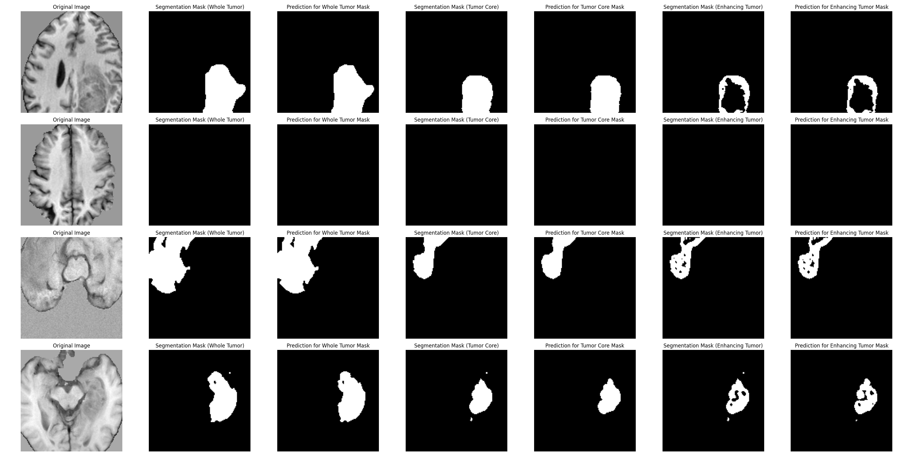
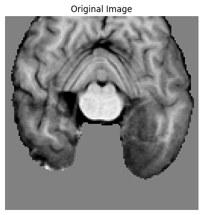
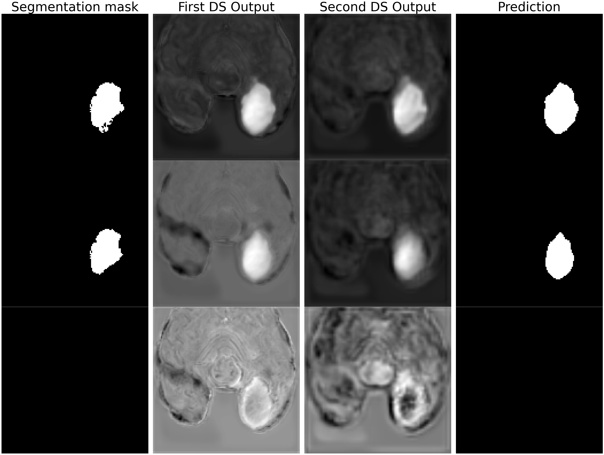

# Brain Tumor Semantic Segmentation

## Contributors
- Fuat Arslan
- Melih Berk Yılmaz


## Files Description
- `data_loading`: This folder contains the code for loading the data from the dataset. It was adapted from the [original repository](https://github.com/NVIDIA/DeepLearningExamples/blob/master/PyTorch/Segmentation/nnUNet/data_loading) of the nnU-Net project.
- `net/utils.py`: Contains utility functions for take configuration parameters from the config file.
- `net/wrappers.py`: Wrapper functions for training and testing the models.
- `net/loss.py`: Implementation of loss functions. Dice loss and cross entropy loss are implemented.
- `net/networks.py`: Contains neural network architectures used for image segmentation.
- `train.py`: Script for training the segmentation models on datasets.
- `test.py`: Script for evaluating the performance of the models on test data.
- `config.yaml`: Configuration file for the project. Contains parameters for training and testing the models.
- `utils/args.py`: Contains functions for parsing command line arguments. It was adapted from the [original repository](https://github.com/NVIDIA/DeepLearningExamples/blob/master/PyTorch/Segmentation/nnUNet/) of the nnU-Net project.
- `sample_out_viz.py`: Script for visualizing the output of the models on sample images.

## Installation
To set up this project, follow these steps:

```bash
git clone https://github.com/fuat-arslan/MRI-Segmentation.git
cd MRI-Segmentation
```

## Train
```
python train.py --model_config config.yaml 
```
## Test
```
python test.py --model_config path/to/config.yaml 
```
Put the config.yaml to the folder of the model for testing. Arange the test data path in the config.yaml file according to your data path.

## Sample Output Visualization






